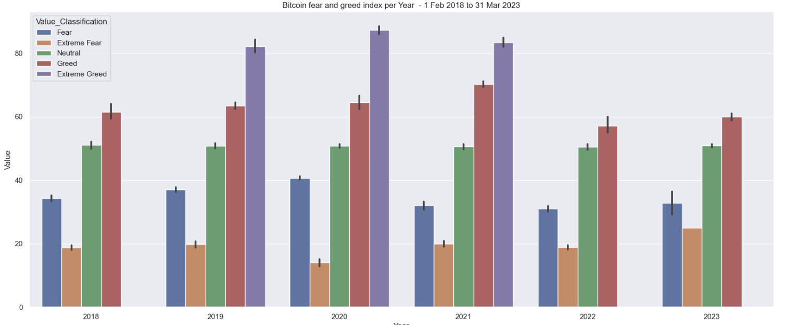

# Bitcoin, Fomo, Predicción y Efecto-Mariposa.


Bitcoin nacio como nacen todos los proyectos, porque intentas solucionar un problema, y en este caso no era un problema pequeño, bitcoin nace porque quiere abordar el problema del control financiero de los estados sobre cada uno de nosotros, y por ello bitcoin se basa en una blockchain descentralizada. La idea era empezar con países menos desarrollados, pero como siempre el capitalismo aparecio...

Dejando de lado los momentos idílicos de proyecto de bitcoin, lo quiero realizar con este proyecto es ver como ha evolucionado el precio de bitcoin durante estos años de vida y porque no, saber si va a crecer y es una interesante estratégia para invertir.

Como extra quería hacer la parte divertida de todo este proyecto, que pasa por ver como agentes externos afectan en nuestra moneda descentralizada, que puede hacer fluctuar el precio de Bitcoin y como afecta a nuestro índice Fear & Geek. 


## DATASET BITCOIN_FOMO
Lo que vamos a ver es un dataset donde encontramos la siguientes variables:


- Date: que es un objeto, que pasaremos a formato fecha.
- Value: valor del índice de miedo y codicia, es un float.
- Value_Classification: clasificación del miedo y la codicia, es un objeto que nos indica el si ese día hubo "fomo" ("fear of missing out"), nos indica el indice de "fear extremo" hasta "Greed extremo".
- BTC_Closing: nos indica el precio de cierre de Bitcoin, es un float.
- BTC_Volume: nos indica el volumen de transacciones que se hicieron, es un float. Volumen de bitcoins que se negociaron ese día.


### EDA Y TRATAMIENTO DE VARIABLES:

Vamos a realizar nuestro porceso exploratorio, a través de:
- info.
- value_counts.
- describe.
- tail.
- head.
- unique.
- duplicated.
- vamos a realizar la buenas practicas con los nombres de las columnas.
- saber si tenemos varibales categoricas.
- saber si tenemos varibales numéricas.


Vamos a tratar las diferentes variables 
- La variables date: la vamos es un objeto la vamos a pasar a fecha.
- La varibale value: la vamos a dejar igual, un float.
    - Tenemos 3 nulos, por falta de información, he mirado si esos días había pasado algo pero no he encontrado nada.
- La variable value_classification: la vamos a mapear y lo que vamos a dar un valor numerico a cada valor.
    - extrem fear, tendrà un valor de -2.
    - fear, tendrà un valor de -1.
    - neutral, tendrá un valor de 0.
    - greek, tendrá un valor de 1.
    - extreme greek, tendrá un valor de 2.
- La variable btc_closing: a vamos a dejar igual, un float.
- La variable btc_volume: a vamos a dejar igual, un float.


Como buenas practicas he usado una función para dejar los nombres de las columnas en los estandars (texto en minúscula y espacios entre palabras con "_").


### Dato interesante: 
Haciendo un recuento de valores en la varibale de "value" nos damos cuenta que cantidad de veces hemos tenido cada sentimiento de mercado, rimeros datos curiosas en el proceso exploratorio.


## FORECASTING CON PROPHET (Pasos para eleborar la predicción con prophet).

El siguiente proceso nos va a proporcionar una comprensión del comportamiento del pasado del precio de Bitcoin y permite hacer predicciones sobre su futuro, utilizando técnicas avanzadas de series temporales con Prophet.

### 1. **Resample y preparación de datos**
He agrupado el Data frame `bit_fom_copy` por día sumando los valores para cada columna (`value`, `value_classification`, `btc_closing`, `btc_volume`), y he obtenido DataFrame `diario` que representa los datos diarios agregados.

- **Resultado**: Un DataFrame `diario` que simplifica los datos originales a una granularidad diaria, mostrando suma de valores de cierre, volumen, etc., por cada día.

### 2. **Limpieza de datos**
He eliminado las columnas `value`, `value_classification`, y `btc_volume` del DataFrame `diario`, dejando solo las columnas `date` y `btc_closing`.

- **Resultado**: Un DataFrame que solo contiene 2 columnas, la columna `date` y la columna `btc_closing` quecrepresenta el precio de cierre diario de Bitcoin.

### 3. **Visualización de la serie temporal**
He creado una visualización del precio de cierre de Bitcoin (`btc_closing`) a lo largo del tiempo desde el 1 de febrero de 2018 hasta el 31 de marzo de 2023 utilizando un gráfico de línea.

- **Resultado**: Un gráfico que muestra las tendencias del precio de cierre de Bitcoin a lo largo del tiempo, de esta manera podemos visualizar aumentos, disminuciones y volatilidad en los precios.


### 4. **Preparación de los datos para Prophet**
He preparado los datos  para ser compatibles con Prophet renombrando las columnas a `ds` (date) y `y` (btc_closing), que es mi varibale obejtivo.

- **Resultado**: Obtengo un DataFrame que Prophet puede interpretar directamente para el modelado, con las columnas renombradas según los requisitos de Prophet (`ds` y `y`).


### 5. **Modelado con Prophet**
He creado la instancia de Prophet para ajustar el modelo a los datos diarios de precios de cierre de Bitcoin. Luego, he generado un DataFrame `future` que proyecta 365 días adicionales del último dato disponible, sin incluir valores para esos días futuros.

- **Resultado**: Obtengo un modelo entrenado capaz de hacer predicciones sobre el precio futuro de Bitcoin. El nuevo DataFrame `future` contiene las fechas futuras para las cuales queremos predecir los precios. 

### 6. **Predicción y visualización**
He utilizado el modelo de Prophet para predecir los precios en el DataFrame `future`. Visualizamos estas predicciones en un gráfico, mostrando tanto los datos históricos como las predicciones futuras con un intervalo de confianza (cono de incertidumbre). 

- **Resultado**: Un gráfico de la serie temporal que incluye tanto los datos históricos como las proyecciones futuras, proporcionando una visualización clara de lo que el modelo espera que suceda con los precios de Bitcoin en el futuro. En nuestro caso a 365 días. Podemos observar como conclusión que al ser una moneda digital su volaitilidad es muy alta y tenenemos un amplio cono de incertidumbre.


### 7. **Desglose de Componentes**
Por último, podemos visualizar los componentes del modelo Prophet (para ver la tendencia, la estacionalidad semanal y la anual).

- **Resultado**: Los gráficos para una representación visual de cómo cada componente contribuye al pronóstico general. Cómo la tendencia cambia con el tiempo, cómo varía la estacionalidad a lo largo del año. 
    - Gráfico trend: Como hemos visto en el grafico anterior nuestro cono de incertidumbre es muy amplio.
    - Gráfico weekly: vemos que los miércoles es un día de donde más se compra a nivel semanal. Tendríamos que profundzar para ver porque sucede esto.
    - Grádico de yearly: en los primeros meses del año tenemos una mayor compra de esta moneda y en los primeros meses del año y a partir de mediados de mayo tenemos un tendecia a la baja, siendo el mes de julio el mes con menor compra finalizando el año con una tendencia al alza. Tendríamos que profundizar para ver estos motivos.


## Índice Bitcoin Fear & Greed

Como curiosidad, os presento este gráfico del índice de miedo y codicia, donde un valor de 0 significa "miedo extremo" mientras que un valor de 100 representa "codicia extrema", que se actualizar diariamente y podéis ver si hoy es un buen día para poder comprar o no y si hoy la gente es codiciosa y compra o por el contrario ha ocurrido alguna cosa que ha hecho que baje el precio y esten vendiendo compulsivamente.


### Análisis de Datos Exploratorio (EDA)

El objetivo de este apartado es comprender mejor los datos con los que estamos trabajando. Voy a trabajar con el Dataframe bit_fom_copy.

1.- Voy a realizar una visualización de los datos con Histogramas y boxplots para cada columna numérica (value, btc_closing, btc_volume) para así entender la distribución de los datos.
Gráficos de series temporales para btc_closing y btc_volume para observar tendencias a lo largo del tiempo.

2.- Voy a realizar, estadísticas descriptivas, cálculo de medidas de tendencia central y dispersión (media, mediana, desviación estándar). Correlaciones entre variables para identificar relaciones preliminares.

Graficos de distribución de las varibles
.png)

.png)

.png)

.png)


Boxplots para visualizar distribuciones y detectar outliers

.png)

.png)

.png)

.png)


Una vez visualizado los histogramas y los boxplots, voy a realizar la matriz de correlación.


Podemos observar lo que era evidente que nuestra variable "value" esta altamente correlacionada con "value_classification", por lo tanto vamos a descartarla para el modelo.

Implementación del modelo.


He obtenido modelo que no es robusto y que el r2 es de 0.3, al estar tratando con un moneda es esperable que el modelo no sea ideal, y se acerque a valores superiores de 0.5, ya que un modelo de 0.7, 0.8 de r2 es bastante utópico al tratarse de una moneda. Al igual que el Pvalue tanto de `btc_volume` como de `value`, son 0, podemos entender que son varibles que son interesantes para el modelo.


### INGENIERÍA DE FUNCIONES (Transformación, Selección, Generación).

Voy a transformar y crear nuevas variables puede ayudar a mejorar la eficacia de los modelos de machine learning. He estado indagando para ver que podía hacer y he optado por estas 3 cosas.
- Añado 3 nuevas columnas que son año, mes y día.
- Creo de una columna de media móvil de 7 días para btc_closing, para suavizar las fluctuaciones del precio de cierre de Bitcoin, de esta manera podemos visualizar mejor las tendencias y la toma de decisiones.
- Normalización de columnas 'btc_closing' y 'btc_volume' con MinMaxScaler.


Gráfico de distribución de btc_closing.

 

Gráfico de distribución de btc_volume.

 

## Preprocesamiento para Regresión Lineal

Antes de modelar, voy a preparar los datos adecuadamente, incluyendo la selección de características y el manejo de multicolinealidad. He encontrado esta función VIF que cuantifica la intensidad de la multicolinealidad. Que variable afecta más.

```from statsmodels.stats.outliers_influence import variance_inflation_factor

# Función para calcular VIF
def calculate_vif(data):
    vif = pd.DataFrame()
    vif["Variables"] = data.columns
    vif["VIF"] = [variance_inflation_factor(data.values, i) for i in range(data.shape[1])]
    return vif

# Calcular VIF en las variables seleccionadas
print(calculate_vif(bit_fom_copy[['value', 'btc_closing', 'btc_volume']]))
```

He obtenido estos resultados:
     Variables       VIF
0        value  2.700282
1  btc_closing  2.947601
2   btc_volume  3.615495

Viendo estos resultados vuel a implementar el modelo de regresion con este resultado. 

.png) 

### Interpretación de resultados:
- R-squared, tiene que ser 0,5 o mayor para que sea fiable.
- P>, cuanto más cerca este de 0 la varible es significativa. A partir de 0,1 ya no es significativo. En nuestro caso las dos varibales son significativas.


## Modelado de Regresión Lineal

Finalmente, modelar los datos para predecir btc_closing. Obteniendo estos resultados.

- R^2 Score: {0.2961269184193249}
- RMSE: {0.21697005718371426}


Posteriormente probado con una transformación y he añadadido 2 variables más, aunque creo qu son solo una de ellas sería suficiente, ya que no estan correlacionadas y he obtenido estos resultados.

- R^2 Score: 0.3538143295192172

Aún sigue siendo un R^2 bajo.

### CURIOSIDADES

Barplot del "value_classification" de los años que tengo en mi Dataframe.

 

Tendencia de Fear and Greed


#### Que paso el 26.06.2019


Voy a buscar el valor más alto en la variable value. 

El resultado a sido de 95.

Esto fue el días 26-06-2019. Que pasó ese día?

https://www.infobae.com/economia/finanzas-y-negocios/2019/06/26/otra-vez-por-las-nubes-el-bitcoin-puede-llegar-a-valer-este-ano-30-000-dolares-o-mas/


#### Que paso el 22.08.2019

Voy a buscar el valor más bajo en la variable value. 

El resultado a sido de 5.0.

Esto fue el días 22-08-2019. Que pasó ese día?

https://ajtapia.com/2019/07/el-bitcoin-no-es-dinero-sino-un-activo-inmaterial-de-contraprestacion-o-de-intercambio-sentencia-de-la-sala-de-lo-penal-del-tribunal-supremo-de-20-de-junio-de-2019-vida-milagros-y-riesgos-de-las-c/


#### Que paso el 08.11.2021

Voy a buscar el:

El día con el valor más alto de cierre de BTC es: 2021-11-08 00:00:00
El valor de cierre máximo de BTC ese día es: 67566.828125


https://www.criptonoticias.com/mercados/precio-bitcoin-alcanza-nuevo-tope-historico-67600-dolares/


----
 

*Por último quiero deciros que esto no es ninguna recomendación para que compreís bitcoin, siempre hacer una análisis por vuestra cuenta y no invirtáis un dinero que no os podéis permitir perder.*